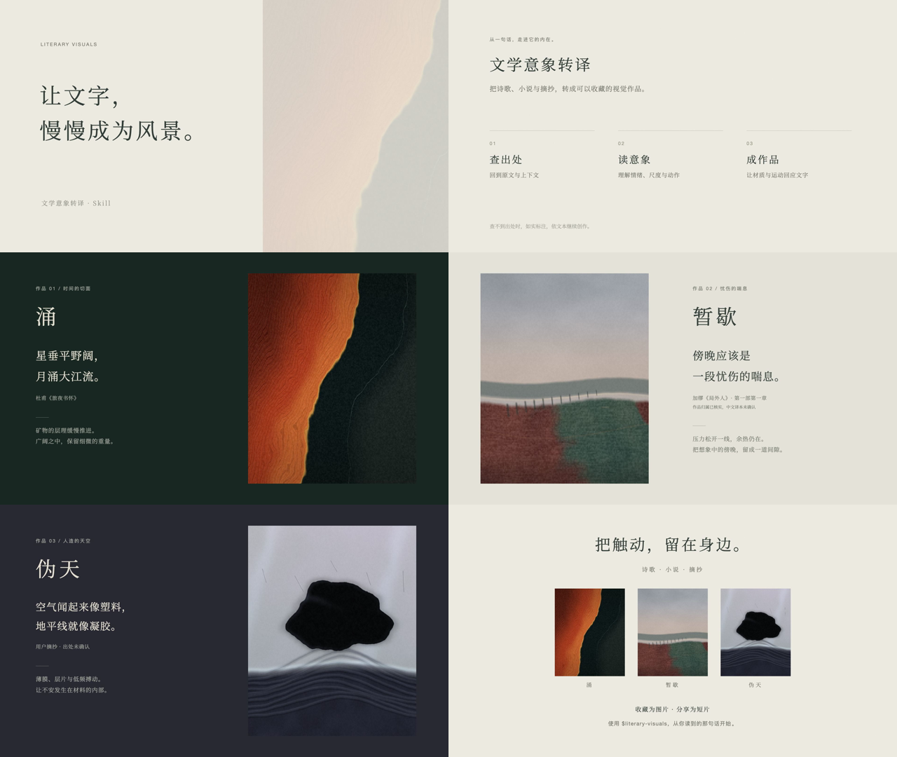

# 文学意象转译 · Literary Visuals

把阅读中的触动，变成可以收藏和分享的视觉作品。

一个用于诗歌、小说、散文与摘抄的 Skill，附三个动态案例与一支使用 Remotion 制作的 64 秒简介短片。

[下载简介视频](https://github.com/bill-gx114/literary-visuals/releases/download/v0.1.0/literary-visuals-intro.mp4) · [下载 Skill](https://github.com/bill-gx114/literary-visuals/releases/download/v0.2.0/literary-visuals.zip) · [最新 Skill 发行版](https://github.com/bill-gx114/literary-visuals/releases/tag/v0.2.0)



## 创作方法

1. **先选择**：通过宿主交互框确认画面表达、图片／视频／HTML、带平台用途提示的尺寸，以及带字／无字版本。已提供的选项不重复问。
2. **查出处**：核对原作与上下文，区分已核实、译本未确认和出处未知。
3. **分型与锚定**：长短文本决定阅读方案；缺席、动作、记忆、悖论等关系决定视觉锚点。长度不直接绑定风格。
4. **比较再创作**：内部比较构图和表达机制不同的方向，选择适合文本的媒介，不固定抽象、复古或相同主体。
5. **看图后修正**：用去字、换句、并置检查画文关系；长文不自动缩成小字，全文与授权节选分别校验。

## v0.2 的实际验证

以两条原创测试句做风格对照：轻盈句采用明亮版画，悖论句采用几何装置。第二幅初稿只像钥匙陈列盒，修正锁孔与遮挡后，封闭关系才更清楚。它们是方向试作，不是自动风格模板；美术判断来自本次创作者看图，并非读者盲测。

| “风一来，晾衣绳上的白衬衫就争着做帆。” | “每一把锁，都把自己的钥匙关在里面。” |
| --- | --- |
|  |  |

[验证记录与限制](docs/validation-v0.2/review.md) · [文本分型](skills/literary-visuals/references/text-treatment.md) · [画文验收](skills/literary-visuals/references/visual-review.md)

## 三个历史案例

| 作品 | 文本 | 视觉表达 |
| --- | --- | --- |
| 涌 · 时间的切面 | 杜甫《旅夜书怀》 | 矿物层理、广阔色域与内部推动力 |
| 暂歇 | 加缪《局外人》 | 红土、灰绿、余热与短暂松弛 |
| 伪天 | 用户摘抄，出处未确认 | 人造薄膜、凝胶层片与低频搏动 |

案例是创作参考，新文字需要重新理解和设计。完整出处与解释见 [案例说明](skills/literary-visuals/references/cases.md)。

## 使用 Skill

下载 Release 中的 `literary-visuals.zip`，解压后将 `literary-visuals` 文件夹放入支持本地 Skill 的 Agent 技能目录。Codex 默认目录为 `~/.codex/skills/`。

v0.2.0 安装包与仓库 `skills/literary-visuals/` 同步，包含文本分型、风格决策、视觉验收和文字容量保护。没有交互框工具的宿主会使用文字选项，也支持“由你决定，直接做”。

> 使用 $literary-visuals，把这段文字转成适合收藏分享的动态作品：……

[完整 Skill 规范](skills/literary-visuals/SKILL.md) · [生成前选择](skills/literary-visuals/references/intake.md) · [制作与导出说明](skills/literary-visuals/references/production.md)

可直接下载并在浏览器打开 `skills/literary-visuals/assets/previews/` 下的三份 HTML；网页内置图片和视频导出。GitHub 文件页展示源代码，不会直接运行 HTML。

## 修改简介视频

```bash
cd remotion-intro
npm ci
npm run studio
```

导出：

```bash
npm run typecheck
npm run render
```

成片为 1920×1080、24 fps、约 64 秒。暖白纸色、宋体、慢转场，无旁白；三个案例按帧绘制真实动态，配无鼓点的合成环境音。

分镜、字体和素材说明见 [Remotion 工程说明](remotion-intro/README.md)。依赖通过 lockfile 固定；仓库不包含 node_modules 或下载的浏览器。

## 文件结构

- `skills/literary-visuals/`：可安装的完整 Skill、规则、参考和制作工具。
- `remotion-intro/`：可编辑的视频工程、字体子集和原创合成音轨。
- `docs/storyboard.png`：简介分镜预览。
- Releases：视频、Skill 安装包、三个作品合集和 Remotion 工程压缩包。

## 验证与素材

v0.2 已通过 Skill 元数据检查、9 项 Python 测试及 10 项排版测试，并实际检查浏览器预览、文字显隐、PNG 导出和溢出拦截。具体浏览器、视频与画面验收结果见上方验证记录。不承诺未经测试的跨平台字体表现。

简介短片属于 v0.1.0 的既有 Remotion 工程，本次未修改或重新渲染。

中文字体为 Noto Serif SC，许可证随工程附带。环境音由 `scripts/make_audio.py` 合成，无外部音乐采样。文学摘抄保留出处状态；未确认的作者和译本不补造。


运行 Skill 回归：

```bash
python3 -m unittest discover -s skills/literary-visuals/tests -v
node --test skills/literary-visuals/tests/test_lettering.js
```

Python 负责交付规格和原文一致性；Node 测试固定字号、断行与容量边界。它们不自动判断审美，创作行为用 `skills/literary-visuals/evals/prompts.json` 另行评审。
